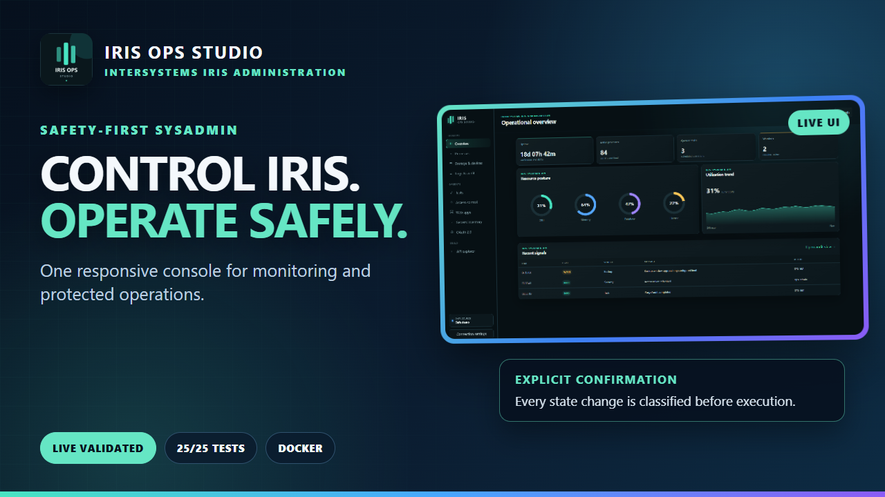
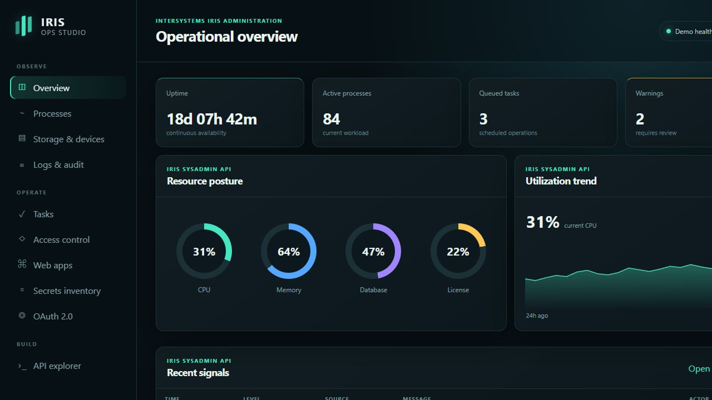
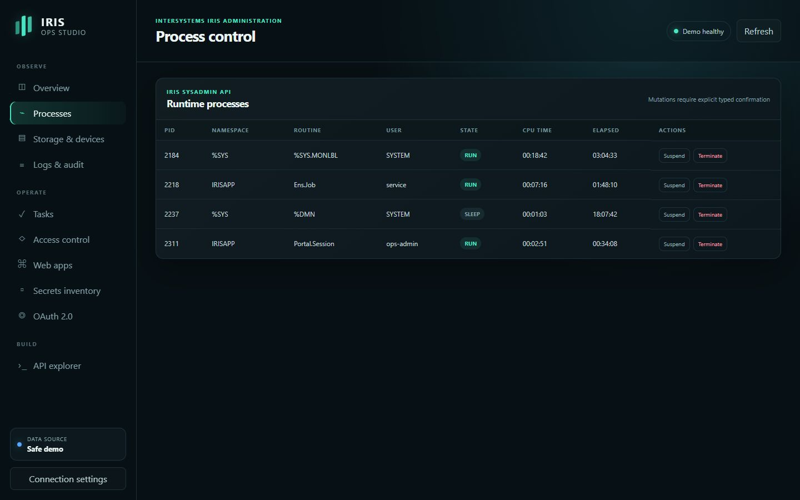
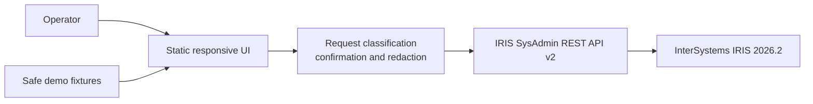

<p align="center">
  
</p>

# IRIS Ops Studio

<p align="center">
  <strong>A safety-first operational console for the InterSystems IRIS SysAdmin API.</strong>
</p>

<p align="center">
  <a href="https://github.com/seypherWork/iris-ops-studio/actions/workflows/ci.yml"></a>
  
  
  <a href="LICENSE"></a>
</p>

IRIS Ops Studio is a safety-first management portal for the InterSystems IRIS
SysAdmin REST API. It turns high-value operational endpoints into a focused,
responsive console for observing a deployment and performing controlled
administrative actions.

The project is an original entry for the **InterSystems Programming Contest:
Build Your Own Management Portal**.

Original challenge and requirements: [Contest 48](https://openexchange.intersystems.com/contest/48).
Validation evidence: [current validation report](docs/validation-report.md).
Status: technically validated and ready for contest review.

## Video demonstration

<p align="center">
  <a href="https://www.youtube.com/watch?v=Vxn_usXOEPU">
    
  </a>
</p>

<p align="center">
  <strong><a href="https://www.youtube.com/watch?v=Vxn_usXOEPU">Watch the IRIS Ops Studio demonstration on YouTube</a></strong>
</p>

The video presents the responsive desktop and mobile interface, the safety
classification model, exact typed confirmations, and sanitized evidence from
the live validation against InterSystems IRIS Community 2026.2.

## Why it is useful

The standard management surface is broad. Operators often need a smaller view
for the tasks they repeat under pressure: checking resource posture, finding a
busy process, reviewing scheduled work, auditing access, and examining a REST
response before changing state. IRIS Ops Studio brings those workflows into one
interface while making the risk of every request visible.

Key features:

- Demo CPU/memory gauges; live performance, license, processes, and task summary.
- Process inspection with protected suspend and terminate actions.
- Scheduled task inspection and execution controls.
- Database storage, device, user, role, and web application inventory views.
- Wallet, X.509, and OAuth 2.0 security configuration views.
- Audit-event query view.
- Built-in explorer for 27 IRIS SysAdmin API operations.
- Native handling of IRIS response envelopes and asynchronous audit queries.
- Typed confirmation for state-changing and destructive requests.
- Recursive redaction of passwords, secrets, tokens, credentials, and private
  keys before API responses are rendered.
- Safe demo mode and a dependency-free local mock server.
- No analytics, external fonts, CDN assets, or browser persistence of passwords.

## Product tour

### Operational overview

The overview brings system posture, workload, licensing, storage, scheduled
tasks, and security signals into a single responsive workspace. Demo data is
always identified as such in the interface.



### Controlled process operations

The Processes workspace keeps inspection and control together. Potentially
destructive actions receive distinct treatment and require an exact generated
confirmation phrase before the request can be sent.



## Quick start: safe demo

Requirements: Node.js 20 or newer.

From the repository root, run the command below. There are no npm dependencies
to install and no frontend compilation step.

```bash
npm start
```

Open <http://127.0.0.1:4173>. The application starts in safe demo mode, so no
IRIS instance or credentials are required.

Run the verification suite:

```bash
npm run check
```

## Run with InterSystems IRIS

The repository contains a ZPM package and a container build. Docker with
BuildKit and access to the InterSystems Community image are required.
The container is pinned to `intersystemsdc/iris-community:2026.2-zpm` because
the login operation requires IRIS 2026.2 or newer according to the official API
specification. The Windows validation builds and runs this exact image.

```bash
docker compose up --build
```

Then open:

```text
http://localhost:52773/csp/ops/index.html
```

On Windows, the release validation can be run from PowerShell after Docker
Desktop is started:

```powershell
powershell -ExecutionPolicy Bypass -File .\scripts\validate-windows.ps1
```

The script builds and starts the container, runs the automated suite, checks
the deployed HTML/CSS/JavaScript, and writes `artifacts/windows-validation.txt`.
It does not request or store credentials.

Use **Connection settings**, disable demo mode, and point the client to the
SysAdmin API, normally `/api/admin`. Authentication is performed against the
official `/api/admin/login` operation.

> Configure the IRIS administrator credential according to the official
> container documentation. The repository intentionally contains no password.
> Do not expose a development instance to an untrusted network.

On a new Community container, open the Management Portal at
`http://localhost:52773/csp/sys/UtilHome.csp`, sign in as `_SYSTEM` with the
initial password `SYS`, and set a new password when IRIS prompts you. Use that
new credential in IRIS Ops Studio. Never commit it to the repository.

## Security model

IRIS Ops Studio does not try to replace IRIS authorization. The connected IRIS
user and assigned roles remain the source of truth.

The UI adds defensive controls at the operator layer:

1. GET, HEAD, and the audit-record query are identified as read-only.
2. POST and PUT operations are identified as state changes.
3. DELETE and high-impact routes such as `terminate`, `purge`, `revoke`, and
   `deactivate` are identified as destructive.
4. Every state-changing request requires an exact, generated confirmation
   phrase before it can be sent.
5. Sensitive response keys are redacted recursively before rendering.
6. The login password is cleared from the form after authentication and is not
   written to local storage, session storage, logs, or URLs.

The access token remains in page memory for the current browser session. A page
reload discards it.

The `/csp/ops/` application serves only static frontend assets and can therefore
be loaded without an IRIS session. Operational data and actions remain protected
by the separate `/api/admin` authentication and authorization layer.

## Supported workflows

| Area | SysAdmin API examples | Portal behavior |
| --- | --- | --- |
| Monitor | `/v2/monitor/dashboard/main`, `/system-resources`, `/system-usage` | Resource posture and workload summary |
| Processes | `/v2/processes`, `/v2/process/suspend`, `/terminate` | Inspect and control runtime processes |
| Infrastructure | `/v2/databases`, `/v2/devices` | Inspect database storage, mount state, and operating-system devices |
| Tasks | `/v2/tasks`, `/v2/task/run`, `/suspend`, `/resume` | Inspect and operate scheduled work |
| Access | `/v2/security/users`, `/roles`, `/resources` | Inventory users and privileges |
| Web apps | `/v2/web-apps`, `/v2/web-app` | Inspect and configure applications |
| Secrets | `/v2/wallet/collections`, `/v2/security/x509-credentials` | Metadata-only protected-asset inventory |
| OAuth 2.0 | `/v2/security/oauth2/client/server-definitions`, `/resource-servers`, `/server/clients` | Inspect authorization servers, resources, clients, and redirect metadata |
| Audit | `/v2/security/audit/records` | Query operational events |
| Explorer | 27 catalogued endpoints plus custom paths | Inspect requests and redacted responses |

The endpoint paths and methods are based on the official
[IRIS SysAdmin API v2 specification](https://github.com/intersystems-community/sysadmin-api-specification).
See [docs/api-compatibility.md](docs/api-compatibility.md) for the contract
details implemented by each workflow.

## Project structure

```text
web/                 Static management portal
  assets/api.js      IRIS client, safety classification, redaction
  assets/app.js      Views, interactions, connection handling
mock/server.mjs      Local static server and representative API fixtures
test/api.test.js     Dependency-free Node test suite
Installer.cls        IRIS namespace/database installer
src/cls/IrisOps/     Package metadata class compiled by ZPM
module.xml           ZPM application manifest
iris.script          Container installation script
Dockerfile           IRIS Community container build
compose.yaml         Local IRIS development stack
docs/                Compatibility, validation, and contest-submission material
```

## Architecture



The production application is a static browser client. It has no application
server and stores no credentials. In live mode, requests go directly from the
browser to the same-origin IRIS SysAdmin API. In demo mode, representative
fixtures make the complete interface reviewable without an IRIS instance.

## Validation status

- JavaScript syntax checks: automated.
- Client, redaction, safety classification, HTTP error, and timeout tests:
  automated with `node:test`.
- Mock-server routes and static application: locally testable without secrets.
- Real IRIS 2026.2 container integration: verified for login, representative
  read endpoints, task execution, and suspend/resume/terminate control of a
  dedicated test process. Invalid input and connection failure were also
  exercised; credentials and access tokens are excluded from the report.
- The latest verified results are recorded in
  [docs/validation-report.md](docs/validation-report.md).

## Design principles

- **Operator intent is explicit.** Risk is visible before an action is sent.
- **Secrets do not become UI content.** The client redacts sensitive keys at the
  transport boundary.
- **Read paths remain fast.** Observation does not require confirmation.
- **The demo is honest.** Demo responses are labeled and mutations are simulated.
- **Deployment stays simple.** The production UI is static and has no runtime
  JavaScript dependencies.

## Roadmap

- Add an optional multi-instance summary for operators responsible for several
  IRIS deployments.
- Export redacted diagnostic snapshots for incident hand-off and review.
- Extend keyboard navigation, accessibility testing, and interface translations.
- Add more tested deployment recipes while preserving the static-client model.

## Contest material

- [Video demonstration](https://www.youtube.com/watch?v=Vxn_usXOEPU)
- [Submission draft](docs/submission.md)
- [90-second demonstration script](docs/demo-script.md)
- [API compatibility notes](docs/api-compatibility.md)
- [Validation report](docs/validation-report.md)

## License

MIT — see [LICENSE](LICENSE).
