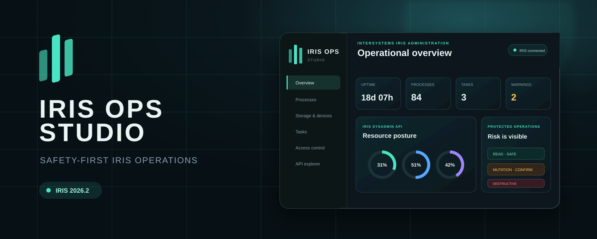
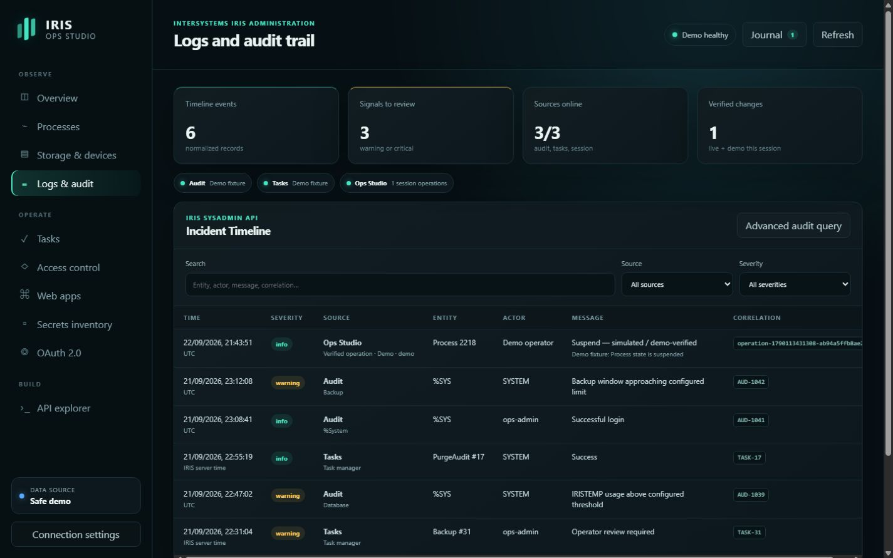
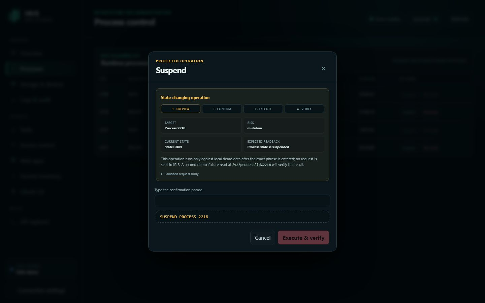
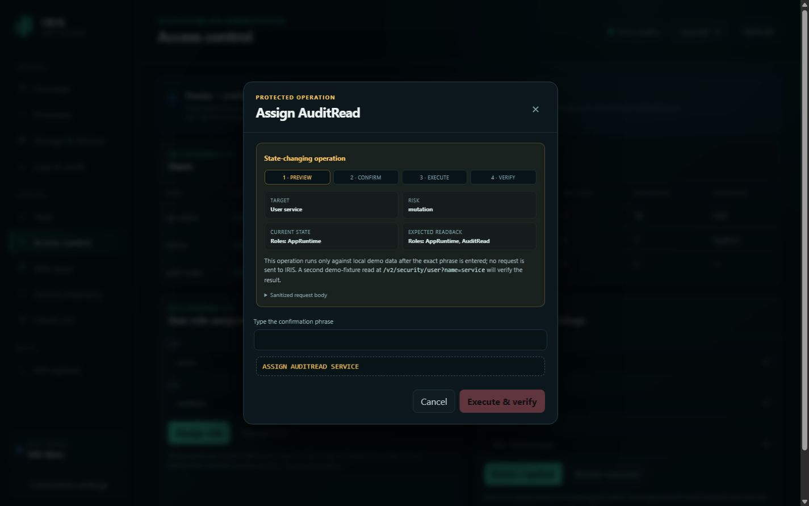
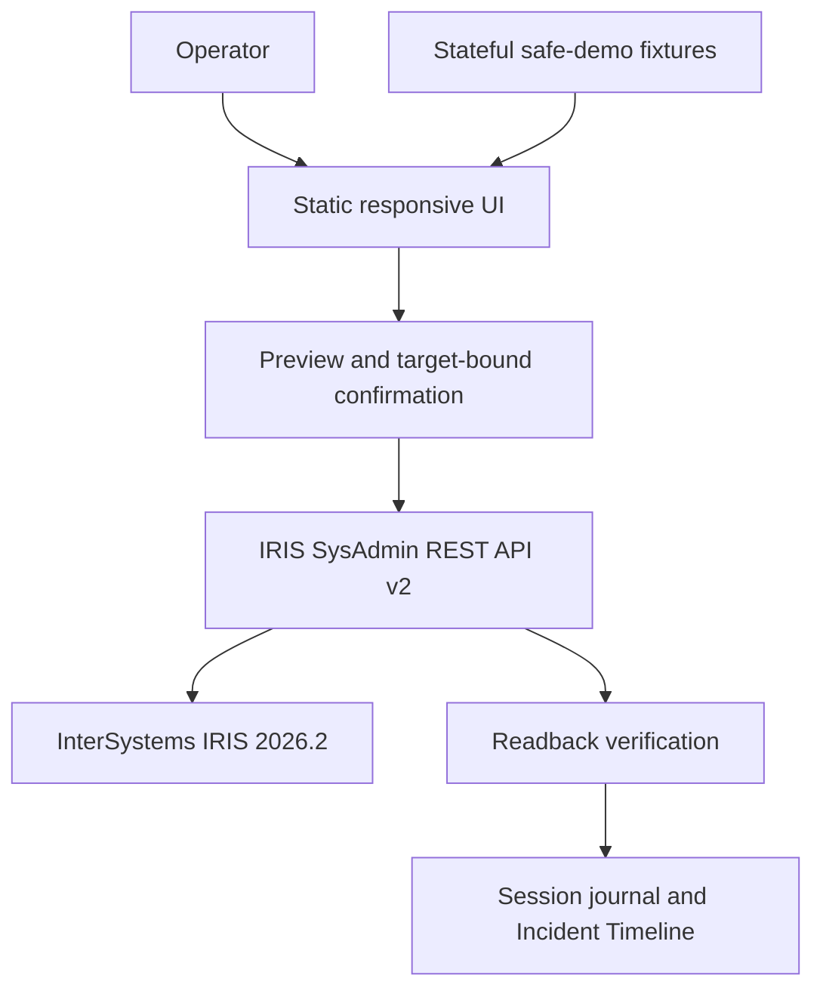

<p align="center">
  
</p>

# IRIS Ops Studio

<p align="center">
  <strong>A safety-first operational console for the InterSystems IRIS SysAdmin API.</strong>
</p>

<p align="center">
  <a href="https://github.com/seypherWork/iris-ops-studio/actions/workflows/ci.yml"></a>
  
  
  <a href="LICENSE"></a>
</p>

IRIS Ops Studio is a safety-first management portal for the InterSystems IRIS
SysAdmin REST API. It turns high-value operational endpoints into a focused,
responsive console for observing a deployment and performing controlled
administrative actions.

The project is an original entry for the **InterSystems Programming Contest:
Build Your Own Management Portal**.

Original challenge and requirements: [Contest 48](https://openexchange.intersystems.com/contest/48).
Validation evidence: [final 1.2.0 remediation report](docs/final-remediation-validation-2026-09-24.md), [earlier 1.2.0 report](docs/web-app-development-validation.md)
and [1.1.0 report](docs/validation-report.md).
Release history: [changelog](CHANGELOG.md).
Developer Community article: [IRIS Ops Studio: a safety-first operations console for InterSystems IRIS](https://community.intersystems.com/post/iris-ops-studio-safety-first-operations-console-intersystems-iris).
Technical article draft: [Beyond HTTP 200: verifiable administrative workflows](docs/community-article-verifiable-operations-en.md).

## Video walkthroughs

- [Original overview](https://www.youtube.com/watch?v=Vxn_usXOEPU) — earlier interface and sanitized live-IRIS evidence.
- [Guided Operations — One Change. Verified.](https://www.youtube.com/watch?v=ezfg4a-BCUk) — 1.1.0 preflight, target-bound confirmation, and readback in the labeled Safe demo.
- [Incident Timeline — From Signal to Evidence](https://www.youtube.com/watch?v=CCJjEhDIXYQ) — 1.1.0 audit, task-history, and browser-session correlation in the labeled Safe demo.

## What's new in 1.2.0

- **Guided web-app availability.** Eligible non-system applications can be
  enabled or disabled with a complete-configuration preview, a fresh check
  immediately before `PUT`, and full readback. Protected, default, ambiguous,
  management, and Ops Studio applications remain inventory-only.
- **Same-origin REST discovery.** The optional catalog reads Management API
  and OpenAPI documentation without invoking listed operations or forwarding
  the SysAdmin token. It clearly reports missing browser authorization.
- **More reliable operations.** Connection changes and delayed responses
  cannot carry a pending preview onto another instance. Task execution waits
  for a *new, successful completion* rather than treating scheduling or an
  old result as success. Uncertain writes remain visible for review.
- **Clearer evidence and safer display.** Explorer resolves asynchronous
  audit responses, the journal distinguishes uncertain outcomes, and
  credential-shaped fields and free text are redacted before display or copy.
  Mobile tables and confirmation controls remain accessible.
- **Straightforward installation.** The ZPM package installs the portal into
  IRIS; the container image and dependency-free Safe demo remain available.
  Versioned asset URLs avoid stale browser files after a fresh installation.

The final source passes **84/84 automated tests**. Its measured aggregate line
coverage is about **79.4% including the browser interaction module**, not a
claim of complete behavior coverage. A fresh IRIS Community 2026.2 image
passed installation, served-file hash and authorization-boundary checks. On
that exact image, a disposable on-demand task was run and suspended through
the UI; IRIS independently confirmed a new successful finish and the final
suspended state. Other guided workflows were checked on separate disposable
instances, with the scope recorded in the
[final validation report](docs/final-remediation-validation-2026-09-24.md).

Limits: the portal is a browser client, so its confirmations do not impose a
server-enforced read-only mode; IRIS authorization remains the server-side
boundary. An in-place upgrade was not tested. REST discovery needs separate
Management API browser permission. Earlier release details are in the
[changelog](CHANGELOG.md).

## Why it is useful

The standard management surface is broad. Operators often need a smaller view
for the tasks they repeat under pressure: checking resource posture, finding a
busy process, reviewing scheduled work, auditing access, and examining a REST
response before changing state. IRIS Ops Studio brings those workflows into one
interface while making the risk of every request visible.

Key features:

- Demo CPU/memory gauges; live performance, license, processes, and task summary.
- Process inspection with protected suspend and terminate actions that honor
  the server's `CanBeSuspended` and `CanBeTerminated` capability flags.
- Scheduled task inspection and execution controls.
- Database storage, device, user, role, and web application inventory views.
- Guided enable/disable for eligible, non-system web applications, with a
  complete-configuration precondition and readback.
- Read-only, independently authorized REST/OpenAPI catalog with an explicit
  unavailable state when the Management API is not accessible.
- Wallet, X.509, and OAuth 2.0 security configuration views.
- Audit-event query view.
- Incident Timeline combining audit records, task history, and the current
  browser session's operation journal, with source, severity, and text filters.
- Built-in explorer for 34 IRIS SysAdmin API operations.
- Native handling of IRIS response envelopes and asynchronous audit queries.
- Preview → typed confirmation → execute → readback verification for supported
  process, task, user-role, and role-resource changes.
- Real user-role assignment/revocation and role-resource grant/revocation
  workflows built from the official mutable SysAdmin API schemas.
- Fail-closed permission plans, full-collection postcondition checks, and a
  fresh precondition read that blocks stale updates before `PUT`.
- Recursive redaction of passwords, secrets, tokens, credentials, and private
  keys before API responses are rendered or operation paths enter the journal.
- Safe demo mode and a dependency-free local mock server.
- No analytics, external fonts, CDN assets, or browser persistence of passwords.

## Jury quick evaluation — 90 seconds

No IRIS instance or credentials are required for this route:

1. Run `npm start`, open <http://127.0.0.1:4173>, and keep **Safe demo** enabled.
2. Open **Processes**, choose **Suspend**, and inspect the preflight comparison,
   exact target-bound confirmation phrase, and automatic readback endpoint.
3. Execute the simulated change, open **Journal**, and observe its
   `demo-verified` result inside Incident Timeline.
4. Open **Access control**, assign a role or grant a resource, and inspect the
   schema-limited request preview before confirmation.
5. Return to **Logs & audit** and filter Audit, Tasks, and Ops Studio events by
   source, severity, text, entity, or correlation identifier.
6. Open **Web apps** to inspect a protected management row, the eligible
   `/api/app` demo fixture, and its target-bound availability preview. The
   separate REST catalog never invokes operations from a specification.

Safe demo never sends an IRIS request. The explorer labels its results as
simulations and declines unsupported or unsafe destinations. Custom API paths
remain available in Live IRIS mode, preferably against a disposable instance;
GET and HEAD requests cannot carry a JSON body.

| Claim | Fast evidence |
| --- | --- |
| Safety is a workflow, not a warning banner | Preflight state, target-bound phrase, execution, readback, and journal entry |
| Permission management is functional | User-role and role-resource mutation cards in Access control |
| Logs cross subsystem boundaries | Audit + task history + session operations in Incident Timeline |
| Known credential-shaped values are redacted | Recursive response, query-secret, audit-text, and task-text tests |
| Review is reproducible | Safe demo, stateful mock API, zero runtime dependencies, and `npm run check` |

## Product tour

All three images below were captured from the 1.1.0 **Safe demo**. They contain
simulated data, not measurements or credentials from a live IRIS instance.

### Incident Timeline

Audit events, task history, and this session's verified demo operation appear
in one filtered timeline. The source chips identify which records are demo
fixtures and which are local session evidence.



### Process preflight

Before suspending the selected process, the operator sees its current state,
expected readback, exact target, and the confirmation phrase. In Safe demo the
operation stays local and is labelled simulated.



### Access-control preflight

The user-role workflow shows the complete before/after roles for a selected
demo user and names the second-read endpoint. The actual change is not sent
until the operator types the target-bound phrase.



## Quick start: safe demo

Requirements: Node.js 22 or 24 LTS.

From the repository root, run the command below. There are no npm dependencies
to install and no frontend compilation step.

```bash
npm start
```

Open <http://127.0.0.1:4173>. The application starts in safe demo mode, so no
IRIS instance or credentials are required.

Run the verification suite:

```bash
npm run check
```

## Run with InterSystems IRIS

The repository contains a ZPM package and a container build. Docker with
BuildKit and access to the InterSystems Community image are required.
The container is pinned to `intersystemsdc/iris-community:2026.2-zpm` because
the login operation requires IRIS 2026.2 or newer according to the official API
specification. The Windows validation builds and runs this exact image.

```bash
docker compose up --build
```

The named volume is configured as IRIS durable `%SYS` storage through
`ISC_DATA_DIRECTORY=/durable/iris`. User definitions, password state, audit
data, and other instance configuration therefore survive ordinary container
recreation. Removing the named volume intentionally resets the instance.

Then open:

```text
http://localhost:52773/csp/ops/index.html
```

On Windows, the release validation can be run from PowerShell after Docker
Desktop is started:

```powershell
powershell -ExecutionPolicy Bypass -File .\scripts\validate-windows.ps1
```

The script builds and starts the container, runs the automated suite, checks
the deployed HTML/CSS/JavaScript, and writes `artifacts/windows-validation.txt`.
It does not request or store credentials.

Use **Connection settings**, disable demo mode, and point the client to the
SysAdmin API, normally `/api/admin`. Authentication is performed against the
official `/api/admin/login` operation.

> Configure the IRIS administrator credential according to the official
> container documentation. The repository intentionally contains no password.
> Do not expose a development instance to an untrusted network.

On a new Community container, open the Management Portal at
`http://localhost:52773/csp/sys/UtilHome.csp`, sign in as `_SYSTEM` with the
initial password `SYS`, and set a new password when IRIS prompts you. Use that
new credential in IRIS Ops Studio. Confirm that IRIS no longer marks the user
as requiring another password change before testing `/api/admin/login`; that is
a one-time instance policy, not an Ops Studio prompt. With the durable volume
in place, the new credential and cleared flag survive later container rebuilds.
Never commit the credential to the repository.

## Security model

IRIS Ops Studio does not try to replace IRIS authorization. The connected IRIS
user and assigned roles remain the source of truth.

The UI adds defensive controls at the operator layer:

1. GET, HEAD, and the audit-record query are identified as read-only.
2. POST and PUT operations are identified as state changes.
3. DELETE and high-impact routes such as `terminate`, `purge`, `revoke`, and
   `deactivate` are identified as destructive.
4. Supported mutations first read the current object and show the expected
   post-operation state. Permission updates repeat that read immediately before
   `PUT` and are blocked if the reviewed object changed meanwhile.
5. Every state-changing request requires an exact confirmation phrase. Built-in
   workflows bind that phrase to the selected process, task, user, or role.
6. Supported process, task, and permission changes perform a second GET and are
   marked verified only when the expected state is observed. Task execution
   requires a new completion timestamp without a running or failure status.
7. Every mutation enters an in-memory session journal with its instance, mode,
   actor, execution result, and verification result. Stale permission previews
   are recorded as blocked; custom Explorer mutations with no safe readback
   remain explicitly unverified.
8. Permission update bodies are rebuilt from documented mutable fields; extra
   response fields are not echoed back to IRIS.
9. Known sensitive response keys and credential-shaped free text are redacted
   before rendering or entering the session journal.
10. The login password is cleared from the form after authentication and is not
   written to local storage, session storage, logs, or URLs.

The access and refresh tokens remain in page memory for the current browser
session. When IRIS expires the short-lived access token, the client uses the
official `/refresh` flow once and rotates both tokens without storing them. A
page reload discards them.

These controls improve operator safety but do not replace server-side
authorization. The browser remains a client, and IRIS privileges are the final
enforcement boundary.

The `/csp/ops/` application serves only static frontend assets and can therefore
be loaded without an IRIS session. Operational data and actions remain protected
by the separate `/api/admin` authentication and authorization layer.

## Supported workflows

| Area | SysAdmin API examples | Portal behavior |
| --- | --- | --- |
| Monitor | `/v2/monitor/dashboard/main`, `/system-resources`, `/system-usage` | Resource posture and workload summary |
| Processes | `/v2/processes`, `/v2/process/suspend`, `/terminate` | Inspect and control runtime processes |
| Infrastructure | `/v2/databases`, `/v2/devices` | Inspect database storage, mount state, and operating-system devices |
| Tasks | `/v2/tasks`, `/v2/task/info`, `/v2/task/history`, `/run`, `/suspend`, `/resume` | Inspect, operate, and verify scheduled work |
| Access | `/v2/security/users`, `/user`, `/roles`, `/role`, `/resources` | Inventory and safely change user roles and role resources |
| Web apps | `/v2/web-apps`, `/v2/web-app` | Inventory applications and guide eligible non-system availability changes |
| Secrets | `/v2/wallet/collections`, `/v2/security/x509-credentials` | Metadata-only protected-asset inventory |
| OAuth 2.0 | `/v2/security/oauth2/client/server-definitions`, `/resource-servers`, `/server/clients` | Inspect authorization servers, resources, clients, and redirect metadata |
| Audit | `/v2/security/audit/records`, `/v2/task/history` | Normalize audit, task, and session-operation evidence into Incident Timeline |
| Explorer | 34 catalogued endpoint/method pairs plus custom paths | Inspect requests, redacted responses, and verification status |

The endpoint paths and methods are based on the official
[IRIS SysAdmin API v2 specification](https://github.com/intersystems-community/sysadmin-api-specification).
See [docs/api-compatibility.md](docs/api-compatibility.md) for the contract
details implemented by each workflow.

## Project structure

```text
web/                 Static management portal
  assets/api.js      IRIS client, safety classification, redaction
  assets/sanitization.js Shared credential-text sanitization
  assets/operations.js Mutation plans, readback verification, timeline normalization
  assets/app.js      Views, interactions, connection handling
mock/server.mjs      Local static server and representative API fixtures
test/api.test.js     Dependency-free Node test suite
test/operations.test.js Permission, verification, journal, and timeline tests
Installer.cls        IRIS namespace/database installer
src/cls/IrisOps/     Package metadata class compiled by ZPM
module.xml           ZPM application manifest
iris.script          Container installation script
Dockerfile           IRIS Community container build
compose.yaml         Local IRIS development stack
docs/                Compatibility, validation, and contest-submission material
```

## Architecture



The production application is a static browser client with no application
server. The password field is transient and cleared after each attempt; the
access and refresh tokens remain only in page memory until reload. In live
mode, requests go directly from the browser to the selected IRIS SysAdmin API.
In demo mode, representative fixtures make the complete interface reviewable
without an IRIS instance.

## Validation status

- **Automated:** seven JavaScript syntax checks and 84/84 tests passed,
  including browser-coordination regressions. Aggregate line coverage in the
  latest run was about 79.4%; a passing suite is not proof of zero defects.
- **Exact final image:** fresh IRIS Community 2026.2 installation, matching
  served-file hashes, unauthenticated API rejection, authenticated navigation,
  and a disposable on-demand task Run/Suspend. IRIS independently showed a
  new successful finish and the final suspended state.
- **Other isolated IRIS checks:** guided Access and web-app changes, blocked
  stale previews, and process controls were exercised on separate disposable
  installations. Those results are not represented as tests of every endpoint
  on the final image.
- **Visual:** all ten areas were opened at measured 1440×900 and 390×844
  viewports without page-level overflow; the mobile confirmation dialog and
  Incident Timeline were inspected. No browser warning/error was observed in
  that session.
- **Reproduce:** `npm run check` runs syntax and test checks; `npm start`
  launches the dependency-free Safe demo. The
  [final validation report](docs/final-remediation-validation-2026-09-24.md)
  distinguishes automated, synthetic-browser and real-IRIS evidence. Earlier
  release history remains in the [changelog](CHANGELOG.md).

## Scope and limits of the evidence

- The 34 catalogued method/path pairs were checked against the official API
  specification; this is **not** a claim that all 34 were executed on live IRIS.
  The live readback evidence covers the guided process, task, user-role, and
  role-resource workflows described in the validation report.
- Confirmation, stale-preview blocking, and the journal are browser-side
  operator safeguards. They do not stop a separately authenticated caller from
  sending an allowed request directly to IRIS. IRIS authorization remains the
  server-side boundary; this release does not provide a server-enforced
  per-tab read-only mode.
- Incident Timeline combines the IRIS audit API, task history, and this
  browser session's operation journal. It does not ingest IRIS messages,
  alerts, journal records, or interoperability logs.
- The guided preflight compares current and expected state for the selected
  target. It does not calculate a full downstream dependency graph or claim
  that every affected user or application has been identified.

## Design principles

- **Operator intent is explicit.** Risk is visible before an action is sent.
- **Secrets do not become UI content.** The client redacts sensitive keys at the
  transport boundary.
- **Read paths remain fast.** Observation does not require confirmation.
- **The demo is honest.** Demo responses are labeled and mutations are simulated.
- **Deployment stays simple.** The production UI is static and has no runtime
  JavaScript dependencies.

## Roadmap

- Add an optional multi-instance summary for operators responsible for several
  IRIS deployments.
- Export redacted diagnostic snapshots for incident hand-off and review.
- Extend keyboard navigation, accessibility testing, and interface translations.
- Add more tested deployment recipes while preserving the static-client model.

## Contest material

- [Three video walkthroughs](#video-walkthroughs)
- [Submission draft](docs/submission.md)
- [90-second demonstration script](docs/demo-script.md)
- [API compatibility notes](docs/api-compatibility.md)
- [1.2.0 validation report](docs/web-app-development-validation.md)

## License

MIT — see [LICENSE](LICENSE).
